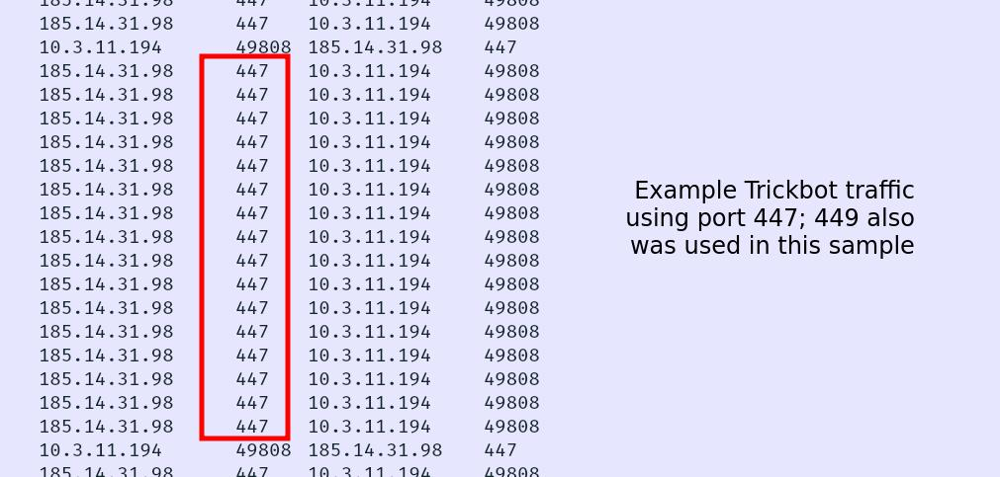
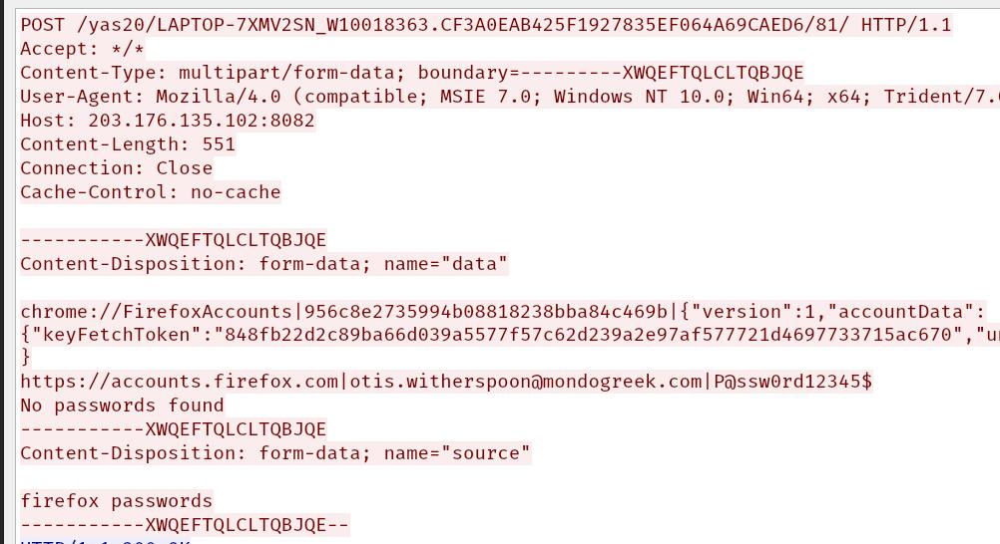
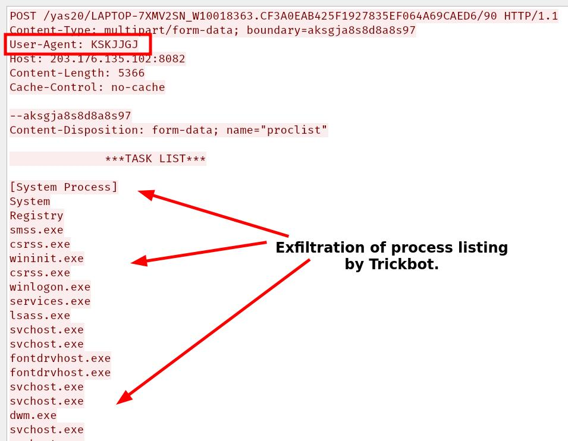
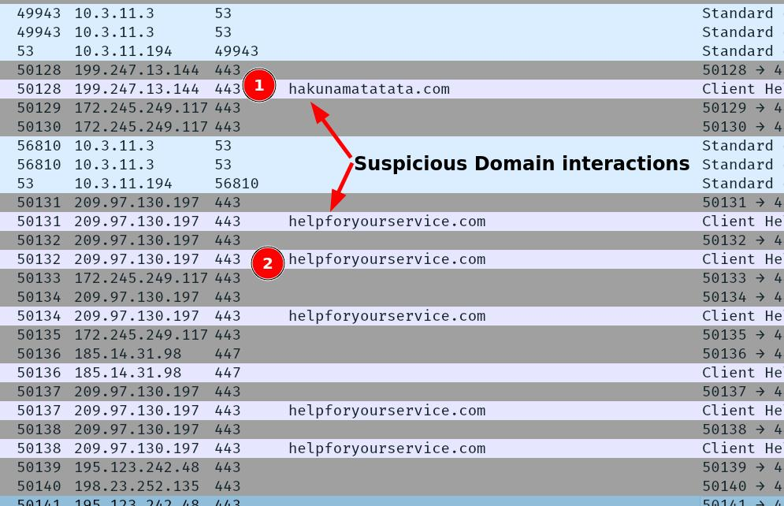

---

author: @linkavych
date: 2022-09-10
link: https://www.malware-traffic-analysis.net/2020/03/14/index.html

---

# Incident Report - mondogreek.com

At approximately 21:24 UTC on March 11, 2020 the system at IP address 10.3.11.194 triggered multiple alerts
for possibly downloading malicious executables. These events were associated with a server at IP address 
`50.87.248[.]17`. From the alert, it appears the `WinHttp` API was used to download
the potential malware, likely via a malicious document macro (also reflected in an alert).

## Initial Information Based on Alerts
- Compromised system: 10.3.11.194
- Potential Malicious Sites:
    - 50.87.248[.]17
    - 45.148.120[.]153
    - 51.254.164[.]244
    - 190.214.13[.]2
    - 185.14.31[.]98
    - 64.44.133[.]131
    - 203.176.135[.]102
    - 199.247.13[.]144
    - 209.97.130[.]197

Several of these alerts were for having a "Let's Encrypt" certificate, which is not necessarily malicious, but
should be considered given the other alerts present in this incident.

## Mondogreek.com Endpoint Summary

- 10.3.11.1 - Gateway (Netgear)
- 10.3.11.3 - MAC: a4:1f:72:c2:09:6a - Mondogreek-DC
- 10.3.11.119 - MAC: 10:98:36:59:9d:cc - LAPTOP-SQSA420 - Windows 10
    - User: dorian.neff
- 10.3.11.194 - MAC: b8:ca:3a:ec:3b:8f - LAPTOP-7XMV2SN - Windows
    - User: Otis Witherspoon (otis.witherspoon)
- 10.3.11.218 - MAC: 00:1d:60:b5:5e:94 - LAPTOP-I9ZPI04 - Windows 10
    - User: dominga.mcdowell
- 10.3.11.255 - Broadcast address

## Summary of Events

At approximatetly 21:24 UTC on March 11, 2020 the system 10.3.11.194, operated by Otis Witherspoon,
made a DNS request to `bolton-tech.com`. The DNS request preceeded an HTTP `GET /YAS20.exe` request over port 80 
to IP address `50.87.248[.]17.` This download a file onto the system. The file is an Windows PE32 executable, with the sha256 hash of
`02db3c6b9aff73bf8a11c41107c836b6c800c919c5d3d1304f336aee03f79f4c`. According to [Hybrid-Analysis](https://www.hybrid-analysis.com/sample/02db3c6b9aff73bf8a11c41107c836b6c800c919c5d3d1304f336aee03f79f4c/5e783c24944e020d1b76c3ac) 
and [Virus Total](https://www.virustotal.com/gui/file/02db3c6b9aff73bf8a11c41107c836b6c800c919c5d3d1304f336aee03f79f4c/details) this file 
is from the [Trickbot](https://malpedia.caad.fkie.fraunhofer.de/details/win.trickbot) family of malware.

After this, the compromised system begins to communicate with several known Trickbot C2
servers, as indicated in the alerts: `185.141.27[.]238` (offline), `45.148.120[.]153`, `51.254.164[.]244`, `190.214.13.2`, and `185.180.198[.]50` (offline). Two of these
servers cause alerts for their certificates as well. Shown below, the first is a default self-signed certificate for `190.214.13[.]2`, and the second is
a blacklisted certificate used by `185.180.198[.]50`.

Another item related to Trick bot C2 is the use of ports 447 and 449, which is commonly seend in other samples.
It is found in this packet capture as well.

Following this C2 pattern, the compromised server begins comunication over HTTP port 80
with a server at `64.44.133[.]131`. This communication channel is established directly with no
use of DNS. This communication results in three `GET` requests, and the download of three
PE files.

- [imgpaper.png](https://www.virustotal.com/gui/file/8aa9c596dd3eb7560bc7416ba181e858f1174fcbcb5432050f3f9a663ed1ffa2/details)
    - sha256: 8aa9c596dd3eb7560bc7416ba181e858f1174fcbcb5432050f3f9a663ed1ffa2
- [cursor.png](https://www.virustotal.com/gui/file/fef9b646dba5c7372fe92b6a9d227833c1d15d8cc3a73fd22be9d1869b21cd67/details)
    - sha256: fef9b646dba5c7372fe92b6a9d227833c1d15d8cc3a73fd22be9d1869b21cd67
- [cursor.png](https://www.virustotal.com/gui/file/68798ccf8e2a5f9682a4e011bec288ad9b3f900244f82c6ae5e8ca538725f92e/details)
    - sha256: 68798ccf8e2a5f9682a4e011bec288ad9b3f900244f82c6ae5e8ca538725f92e

After the downloads have begun, the first signs of data exfiltration can be seen in a
series of `POST` requests made to `203.1176.135[.]102:8082`. The `POST` request follows
the below general format:

- `POST /yas20/LAPTOP-7XMV2SN_W10018363.CF3A0EAB425F1927835EF064A69CAED6/81/ HTTP/1.1\r\n`

Each post-request (for a total of five) is exfiltrating different pieces of data from the comrpromised system, as shown below:

Following the exfiltration of data, the comrpomised system interacts with two additional domains which are suspicious.
The traffic is encrypted, and - at the time of the exercise publishing - the domains had only been registered as of March 2020.

## Indicator of Compromise

## Host
- `YAS20.exe`
- `cursor.png`
- `imgpaper.png`

### Commands Executed by Malware

1. Process listing
2. Systeminfo minimum
3. `cmd.exe /c ipconfig /all`
4. `cmd.exe /c net config workstation`
5. `cmd.exe /c new view /all`
6. `cmd.exe /c net view /all /domain`
7. `cmd.exe /c nltest /domain_trusts`
8. `cmd.exe /c nltest /domain_trusts /all_trusts`
9. Local Machine Data
10. Admin Name

## Network
- UA: `KSKJJGJ`
- 50.87.248[.]17
- 45.148.120[.]153
- 51.254.164[.]244
- 190.214.13[.]2
- 185.14.31[.]98
- 64.44.133[.]131
- 203.176.135[.]102
- 199.247.13[.]144
- 209.97.130[.]197
- bolton-tech[.]com
- hakunamatata[.]com
- helpforyourservice[.]com
