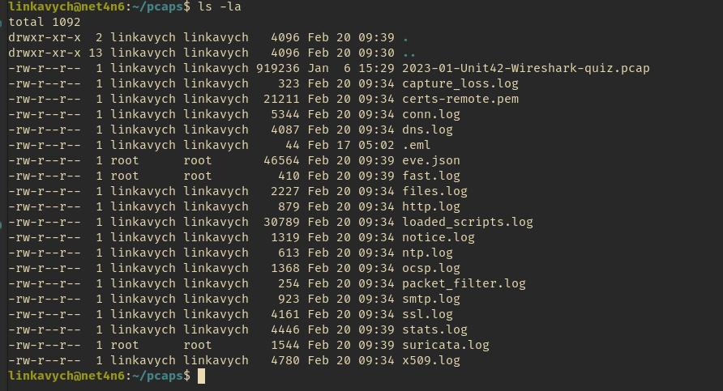
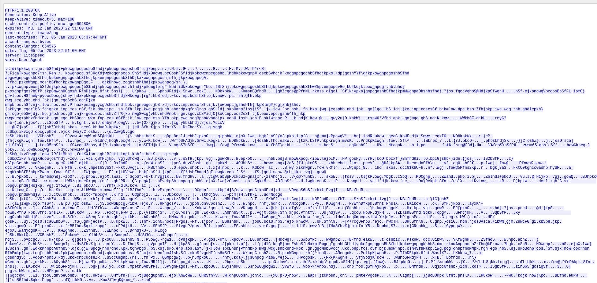

# Malware Traffic Analysis/Unit42  - January WireShark Quiz

Link: https://unit42.paloaltonetworks.com/january-wireshark-quiz/

## Examination

Unit42 and @malware_traffic have created a simple Windows network environment within
which to detonate this malware. Specifically, they state:

> This month, our infected host is a stand-alone Windows client. In addition to Windows system traffic, 
> the pcap also contains unencrypted SMTP traffic generated by the malware. 
> This traffic contains additional information, so we can determine all four of the above identifiers.
> The SMTP traffic includes various login credentials from the infected host. 
> Of note, this traffic does not contain legitimate credentials. 
> We populated the host with fake login data before we ran the malware. 
> Despite the fake data, this traffic provides a better understanding of data stolen by Agent Tesla variants like OriginLogger.

The initial questions for the quiz are to establish details about the victim. But, before 
diving into wireshark I will run the pcap through [zeek]() and [suricata]() to gain
some additional context.

```bash
zeek -r 2023-01-Unit42-Wireshark-quiz.pcap local

sudo suricata -r 2023-01-Unit42-Wireshark-quiz.pcap
```



Much like using the 'Conversations' view in Wireshark, I can gain a quick understanding of the converations
taking place with the `conn.log` from Zeek. With a little command line organization with zeek-cut, we can get
a general sense of what is going on:

```bash
cat conn.log | zeek-cut id.orig_h id.resp_h id.resp_p | sort -k2 | uniq -c | sort -nr

     13 192.168.1.27    192.168.1.1     53
      3 192.168.1.27    192.168.1.1     137
      2 192.168.1.27    52.109.77.1     443
      1 192.168.1.27    64.185.227.156  443
      1 192.168.1.27    52.137.108.250  443
      1 192.168.1.27    52.113.194.132  443
      1 192.168.1.27    45.56.99.101    80
      1 192.168.1.27    40.77.2.164     443
      1 192.168.1.27    40.126.29.10    443
      1 192.168.1.27    40.119.6.228    123
      1 192.168.1.27    239.255.255.250 1900
      1 192.168.1.27    23.5.87.173     443
      1 192.168.1.27    204.11.58.28    587
      1 192.168.1.27    192.168.1.255   138
      1 192.168.1.27    104.46.162.226  443
```

So, `192.168.1.27` is our likely victim in this network. `192.168.1.1` is our gateway and DNS for the network.
Then we have a mixture of connections to unique destination IPs over a combination of ports 443, 80, 123, 587, 138, and 1900.
Looking at the data transfered from these connections, excluding the gateway, can give a sense of interesting interactions.

```bash
cat conn.log | zeek-cut id.orig_h id.resp_h id.resp_p orig_bytes resp_bytes| sort -nrk5 | grep -v '192.168.1.1'

192.168.1.27    45.56.99.101    80      76      664921
192.168.1.27    52.113.194.132  443     1011    29941
192.168.1.27    40.126.29.10    443     5502    16376
192.168.1.27    52.109.77.1     443     831     14560
192.168.1.27    52.109.77.1     443     831     14560
192.168.1.27    52.137.108.250  443     6200    13497
192.168.1.27    23.5.87.173     443     580     6522
192.168.1.27    64.185.227.156  443     452     6491
192.168.1.27    40.77.2.164     443     44962   5576
192.168.1.27    104.46.162.226  443     2232    4905
192.168.1.27    204.11.58.28    587     2067    554
192.168.1.27    40.119.6.228    123     -       -
192.168.1.27    239.255.255.250 1900    411     0
192.168.1.27    192.168.1.255   138     -       -
```

From this we can see a healthy amount of data was transfered to our victim from `45.56.99[.]101`. This could
be a strating point for our analysis, but lets check the `dns.log` from zeek to see what it can show first.

```bash
cat dns.log | zeek-cut -du ts query answers | column -t

2023-01-05T22:51:00+0000  savory.com.bd                                      45.56.99.101
2023-01-05T22:51:25+0000  api.ipify.org                                      api4.ipify.org,64.185.227.156,173.231.16.76,104.237.62.212
2023-01-05T22:51:29+0000  mail.transgear.in                                  transgear.in,204.11.58.28
2023-01-05T22:53:10+0000  wpad.localdomain                                   -
2023-01-05T22:53:11+0000  wpad.localdomain                                   -
2023-01-05T22:53:13+0000  wpad.localdomain                                   -
2023-01-05T22:53:28+0000  dns.msftncsi.com                                   131.107.255.255
2023-01-05T22:55:34+0000  login.live.com                                     login.msa.msidentity.com,www.tm.lg.prod.aadmsa.akadns.net,prda.aadg.msidentity.com,www.tm.a.prd.aadg.akadns.net,40.126.29.10,40.126.29.11,20.190.157.11,40.126.29.8,40.126.29.14,40.126.29.9,40.126.29.5,40.126.29.12
2023-01-05T22:55:34+0000  time.windows.com                                   twc.trafficmanager.net,40.119.6.228
2023-01-05T22:55:34+0000  licensing.mp.microsoft.com                         consumer-licensing-aks2aks.md.mp.microsoft.com.akadns.net,licensing-prod-frontdoor-geomap.trafficmanager.net,wus2.frontdoor.licensing.commerce.microsoft.com,52.137.108.250
2023-01-05T22:55:38+0000  storecatalogrevocation.storequality.microsoft.com  storecatalogrevocation.storequality.microsoft.com.edgekey.net,e10198.b.akamaiedge.net,23.5.87.173
2023-01-05T22:55:59+0000  fe3cr.delivery.mp.microsoft.com                    fe3.delivery.mp.microsoft.com,glb.cws.prod.dcat.dsp.trafficmanager.net,40.77.2.164
2023-01-05T22:56:00+0000  ecs.office.com                                     ecs.office.trafficmanager.net,s-0005-office.config.skype.com,ecs-office.s-0005.s-msedge.net,s-0005.s-msedge.net,52.113.194.132
2023-01-05T22:56:00+0000  nexusrules.officeapps.live.com                     prod.nexusrules.live.com.akadns.net,52.109.77.1
2023-01-05T22:56:00+0000  v10.events.data.microsoft.com                      global.asimov.events.data.trafficmanager.net,onedscolprdaus02.australiasoutheast.cloudapp.azure.com,104.46.162.226
```

This gives us a couple of indicators worth exploring further. First, the domain `savory.com[.]bd` correlates
to the IP address transferring the most data. Second, malware typically checks for an internet conenction
using public APIs like `api4.ipify[.]org` or other services - but we already know this PCAP contains malware.
Finally, we see some interesting mail activity is possible (also stated by Unit42) given the DNS resolution
of `mail.transgear[.]in` to `204.11.58[.]28`.

We know from Unit42's prompt that this infection chain has started from the user double-clicking
on an `.iso` image and then the `.exe` loader for, possibly, `OriginLogger` and Agent Tesla-style activity. The zeek logs show this HTTP activity to
the IP of interest `45.56.99[.]101` with a `GET` request for `/sav/Ztvfo.png`. The SHA-1 hash for this file is: `aaaad89801568b12106b8e3b6c0416c36710107a`.


This retrieves an encoded payload, which the loader would then decode and execute on the target. The encoded payload can be seen clearly in Wireshark:



At this point, the malware shifts to data exfiltration via SMTP, which is also capture in our Zeek logging output
as well as by Suricata with an alert.

```bash
cat fast.log | grep ET

01/05/2023-17:51:00.081370  [**] [1:2030171:1] ET MALWARE AgentTesla Exfil Via SMTP [**] [Classification: A Network Trojan was detected] [Priority: 1] {TCP} 192.168.1.27:51958 -> 204.11.58.28:587
```

```bash
cat smtp.log | zeek-cut -dum ts id.orig_h id.resp_h id.resp_p helo mailfrom rcptto subject | column -t

ts                        id.orig_h     id.resp_h     id.resp_p  helo             mailfrom                rcptto                        subject
2023-01-05T22:51:30+0000  192.168.1.27  204.11.58.28  587        DESKTOP-WIN11PC  marketing@transgear.in  zaritkt@arhitektondizajn.com  PW_windows11user/DESKTOP-WIN11PC
```

The Zeek `smtp.log` gives a few additional pieces of information about our victim such as username (win11user), and the emails involved
in the transaction. The wireshark view of this SMTP trafic also confirms the `mailfrom` email
is the login for the mail server used, and the password is: `M@ssw0rd#621`.


Wireshark makes it easy to export emails from SMTP traffic, which we can do and find the below is the exfiltrated data:

```text
MIME-Version: 1.0
From: marketing@transgear.in
To: zaritkt@arhitektondizajn.com
Date: 5 Jan 2023 22:51:31 +0000
Subject: PW_windows11user/DESKTOP-WIN11PC
Content-Type: text/html; charset=us-ascii
Content-Transfer-Encoding: quoted-printable

Time: 01/05/2023 22:51:26<br>User Name: windows11user<br>Computer=
 Name: DESKTOP-WIN11PC<br>OSFullName: Microsoft Windows 11 Pro<br=
>CPU: Intel(R) Core(TM) i5-13600K CPU @ 5.10GHz<br>RAM: 32165.83 =
MB<br>IP Address: 173.66.46.112<br><hr>URL:imap://mail.windows11u=
sers.com<br>=0D=0AUsername:admin@windows11users.com<br>=0D=0APass=
word:EBj%U7-p@q4NW<br>=0D=0AApplication:Thunderbird<br>=0D=0A<hr>=
=0D=0AURL:smtp://mail.windows11users.com<br>=0D=0AUsername:admin@=
windows11users.com<br>=0D=0APassword:EBj%U7-p@q4NW<br>=0D=0AApplicat=
ion:Thunderbird<br>=0D=0A<hr>=0D=0AURL:webmail.windows11users.com=
<br>=0D=0AUsername:admin@windows11users.com<br>=0D=0APassword:EBj=
%U7-p@q4NW<br>=0D=0AApplication:Edge Chromium<br>=0D=0A<hr>=0D=0AURL=
:https://login.us.coca-cola.com/<br>=0D=0AUsername:admin@windows1=
1users.com<br>=0D=0APassword:Zp61-7$r#J_iLpCYV&jKr<br>=0D=0AAppli=
cation:Edge Chromium<br>=0D=0A<hr>=0D=0AURL:https://www.linkedin.=
com/<br>=0D=0AUsername:admin@windows11users.com<br>=0D=0APassword=
:TqQPvG#0g%$ga_q51<br>=0D=0AApplication:Edge Chromium<br>=0D=0A<h=
r>=0D=0AURL:https://www.amazon.com/ap/signin<br>=0D=0AUsername:ad=
min@windows11users.com<br>=0D=0APassword:3Fo76#PTf4P$Im!9mkLso69e=
T<br>=0D=0AApplication:Edge Chromium<br>=0D=0A<hr>=0D=0AURL:https=
://www.target.com/login<br>=0D=0AUsername:windows11user<br>=0D=0APas=
sword:c$Kl3wO!e#i7A&!L2<br>=0D=0AApplication:Edge Chromium<br>=0D=0A=
<hr>=0D=0AURL:https://myaccount.nytimes.com/auth/login<br>=0D=0AU=
sername:admin@windows11users.com<br>=0D=0APassword:u*N21Or650yBps=
p45awSa<br>=0D=0AApplication:Edge Chromium<br>=0D=0A<hr>=0D=0A
```

From this, we can see the malware is capturing credentials from the browser and where else
it can on the target system. It is also capturing basic system statics such as CPU (Intel Core i5-13600K), RAM (32165.83 MB), and the public IP (173.66.46[.]112).

We could also use `tcpdump` for the majority of this analysis, but as an example we cna just look at this SMTP traffic with a few commands to pull the same data:

```bash
tcpdump -ntr file.pcap 'port 587`

reading from file 2023-01-Unit42-Wireshark-quiz.pcap, link-type EN10MB (Ethernet), snapshot length 65535
IP 192.168.1.27.51958 > 204.11.58.28.587: Flags [S], seq 3078620335, win 64240, options [mss 1460,nop,wscale 8,nop,nop,sackOK], length 0
IP 204.11.58.28.587 > 192.168.1.27.51958: Flags [S.], seq 377273077, ack 3078620336, win 64240, options [mss 1460], length 0
IP 192.168.1.27.51958 > 204.11.58.28.587: Flags [.], ack 1, win 64240, length 0
IP 204.11.58.28.587 > 192.168.1.27.51958: Flags [P.], seq 1:179, ack 1, win 64240, length 178
IP 192.168.1.27.51958 > 204.11.58.28.587: Flags [P.], seq 1:23, ack 179, win 64062, length 22
IP 204.11.58.28.587 > 192.168.1.27.51958: Flags [.], ack 23, win 64240, length 0
IP 204.11.58.28.587 > 192.168.1.27.51958: Flags [P.], seq 179:356, ack 23, win 64240, length 177
IP 192.168.1.27.51958 > 204.11.58.28.587: Flags [P.], seq 23:68, ack 356, win 63885, length 45
IP 204.11.58.28.587 > 192.168.1.27.51958: Flags [.], ack 68, win 64240, length 0
IP 204.11.58.28.587 > 192.168.1.27.51958: Flags [P.], seq 356:374, ack 68, win 64240, length 18
IP 192.168.1.27.51958 > 204.11.58.28.587: Flags [P.], seq 68:86, ack 374, win 63867, length 18
IP 204.11.58.28.587 > 192.168.1.27.51958: Flags [.], ack 86, win 64240, length 0
IP 204.11.58.28.587 > 192.168.1.27.51958: Flags [P.], seq 374:404, ack 86, win 64240, length 30
IP 192.168.1.27.51958 > 204.11.58.28.587: Flags [P.], seq 86:122, ack 404, win 63837, length 36
IP 204.11.58.28.587 > 192.168.1.27.51958: Flags [.], ack 122, win 64240, length 0
IP 204.11.58.28.587 > 192.168.1.27.51958: Flags [P.], seq 404:412, ack 122, win 64240, length 8
IP 192.168.1.27.51958 > 204.11.58.28.587: Flags [P.], seq 122:162, ack 412, win 63829, length 40
IP 204.11.58.28.587 > 192.168.1.27.51958: Flags [.], ack 162, win 64240, length 0
IP 204.11.58.28.587 > 192.168.1.27.51958: Flags [P.], seq 412:426, ack 162, win 64240, length 14
IP 192.168.1.27.51958 > 204.11.58.28.587: Flags [P.], seq 162:168, ack 426, win 63815, length 6
IP 204.11.58.28.587 > 192.168.1.27.51958: Flags [.], ack 168, win 64240, length 0
IP 204.11.58.28.587 > 192.168.1.27.51958: Flags [P.], seq 426:482, ack 168, win 64240, length 56
IP 192.168.1.27.51958 > 204.11.58.28.587: Flags [P.], seq 168:417, ack 482, win 63759, length 249
IP 204.11.58.28.587 > 192.168.1.27.51958: Flags [.], ack 417, win 64240, length 0
IP 192.168.1.27.51958 > 204.11.58.28.587: Flags [P.], seq 417:1440, ack 482, win 63759, length 1023
IP 204.11.58.28.587 > 192.168.1.27.51958: Flags [.], ack 1440, win 64240, length 0
IP 192.168.1.27.51958 > 204.11.58.28.587: Flags [P.], seq 1440:2055, ack 482, win 63759, length 615
IP 204.11.58.28.587 > 192.168.1.27.51958: Flags [.], ack 2055, win 64240, length 0
IP 192.168.1.27.51958 > 204.11.58.28.587: Flags [P.], seq 2055:2057, ack 482, win 63759, length 2
IP 204.11.58.28.587 > 192.168.1.27.51958: Flags [.], ack 2057, win 64240, length 0
IP 192.168.1.27.51958 > 204.11.58.28.587: Flags [P.], seq 2057:2062, ack 482, win 63759, length 5
IP 204.11.58.28.587 > 192.168.1.27.51958: Flags [.], ack 2062, win 64240, length 0
IP 204.11.58.28.587 > 192.168.1.27.51958: Flags [P.], seq 482:510, ack 2062, win 64240, length 28
IP 192.168.1.27.51958 > 204.11.58.28.587: Flags [.], ack 510, win 63731, length 0
IP 192.168.1.27.51958 > 204.11.58.28.587: Flags [P.], seq 2062:2068, ack 510, win 63731, length 6
IP 204.11.58.28.587 > 192.168.1.27.51958: Flags [.], ack 2068, win 64240, length 0
IP 204.11.58.28.587 > 192.168.1.27.51958: Flags [FP.], seq 510:555, ack 2068, win 64240, length 45
IP 192.168.1.27.51958 > 204.11.58.28.587: Flags [.], ack 556, win 63686, length 0
IP 192.168.1.27.51958 > 204.11.58.28.587: Flags [F.], seq 2068, ack 556, win 63686, length 0
IP 204.11.58.28.587 > 192.168.1.27.51958: Flags [.], ack 2069, win 64239, length
```

Not a lot of traffic to sort through goint to/from port 587. As a result, we can add the `-X` flag to our previous command
and sort through the traffic to see the plaintext information Wireshark pulls out for us and parses.


And next we can see the email contents as before:


Just another way of coming to the same conclusions, but more of a command line focus.

## Answer to Questions
### Victim Information

1. Victim's IP: 192.168.1.27
2. Victim's MAC Address: bc:ea:fa:22:74:fb
3. Victim's Windows Host Name: DESKTOP-WIN11PC
4. Victim's Windows User Account name: windows11user

### Detail Information

1. When did the malicious traffic start in UTC?
    - The DNS request to `savory.com[.]bd` was sent at approximately 2023-01-05 2251 UTC, beginning the maclicious stream of traffic.

2. What is the victim’s IP address?
    - 192.168.1[.]27

3. What is the victim’s MAC address?
    - BC:EA:FA:22:74:FB

4. What is the victim’s Windows host name?
    - DESKTOP-WIN11PC

5. What is the victim’s Windows user account name?
    - win11user

6. How much RAM does the victim’s host have?
    - 32165.83 MB

7. What type of CPU is used by the victim’s host?
    - Intel Core i5-13600k CPU @ 5.10GHz

8. What is the public IP address of the victim’s host?
    - 173.66.46[.]112

9. What type of account login data was stolen by the malware?
    - Email account credentials, and credentials stored in the browser.
